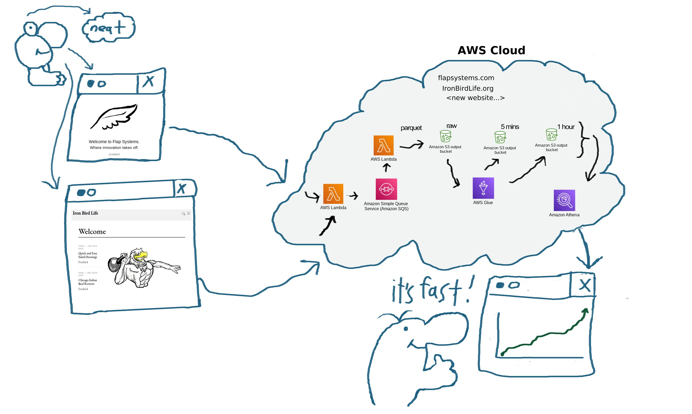

**Dan Freeman**

**Highly Experienced Full Stack Developer**
- Systems Design
- Serverless Applications
- Visulization Engineer
- Big Data Analysis
- Big Data Pipelines
- AWS Analystics
- NoSql Databases
- Object and Relational Databases
- SQL Optimization
- Java, Python, NodeJS, React
- HTML/CSS Expert

 
**Websites**
- Blog: [ironbirdlife.org](https://ironbirdlife.org)
- Resume: [danfreeman.us](https://danfreeman.us)
- Flap Systems: [flapsystems.com](https://flapsystems.com)

**Other**
- Fitness enthusiast
- Yesteryear's normal: Marathon, Triathlon, CrossFit
- Today's normal: barbell squats and deadlifts followed by high intensity interval routines
- Sporting event nickname: _Freebird_

**This github account's primary focus is the 'Flap' repo or: "Freebird's Cloud Analytics Platform"** (please request access at this time)
- Open source tools for collecting Real User Performance Metrics for your web based application
- Custom graphs available to see your trending stats and daily aggregates
- Synthetically measure your website's performance and visualize along side your RUM metrics
- _Flap_ offers a cloud based platform for you, for **free**. Flap is a customized and integrated system of performance measurement tools, for your web based application performance measuring needs

 **Flap Multi Tenant Cloud Architecture**
   - Each domain that is recording beacons has it's own cloud stack in the flapsystem AWS account
   - Beacons from each domain belong to their own private S3 bucket, beacons from other domains will not be allowed in.
   - Each domain can only submit to it's respective receiver lambda, cors policy enforces this rule.
   - Each instance in the diagram is replicated per domain (ie, each domain has it's own: bucket, queue, lambdas, etc...)
   - With the exception of core common lambda code being shared between cloud stacks via the use of AWS Layers, enabling tiny deploy sizes and code reuse
   
   
